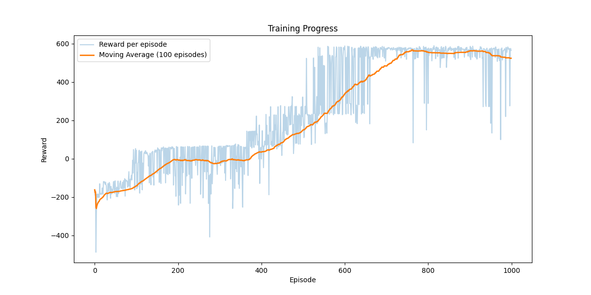

# Collector with Policy Gradient

**"Team_Two" Reinforcement Learning Project using Proximal Policy Optimization (PPO)**

---

## Introduction

In this project, we demonstrate the use of Proximal Policy Optimization (PPO), an advanced policy gradient algorithm, applied within a custom-built PyGame environment. Our primary goal is to explore key concepts in reinforcement learning, implement the PPO algorithm from scratch, and evaluate interactions between our learning agent and its environment through practical experimentation.

---

## Repository Structure

- **`/src`**: Contains the source code necessary for PPO, the environment, training loops, and evaluations.
  - `agent.py`: PPO agent implementation including policy definition, action selection, and model checkpoint handling.
  - `environment.py`: Defines the custom environment logic, handling interactions with reward items (balls) and penalty items (traps).
  - `train.py`: Manages training loop and hyperparameter configurations.
  - `evaluate.py`: Runs trained agent evaluations.
  - `testing.py`: Facilitates manual testing of the environment without RL intervention.
  - `plot_results.py`: Generates visual representations of training outcomes.

- `/saved_models`: Stores trained models.
- `/training_plots`: Stores visualizations of training performance.

---

## Running Instructions

### Instalation

You can set up a virtual environment using `venv` to manage dependencies cleanly.

```bash
python -m venv rl_env
source rl_env/bin/activate
pip install -r requirements.txt
```
On Windows:
```bash
python -m venv rl_env
rl_env\Scripts\activate
pip install -r requirements.txt
```

### Training and Evaluation Instructions

#### Training
To train the PPO agent, execute the `train.py` script with optional parameters to control the variability of the environment:

```bash
python src/train.py --variability 0 --max_variability 50 --variability_step 0.5 --variability_interval 25
```

It will save the created model checkpoints in the directory `/saved_models`. The models will be saved every 250 episodes.

#### Evaluation
To evaluate a trained model checkpoint, run:

```bash
python src/evaluate.py saved_models/ppo_ep1000.pth.pth
```
Replace `model_checkpoint.pth` with the filename of the trained model checkpoint you want to evaluate stored in `/saved_models`.

---

## Environment Description

Our custom environment simulates a 2D collector scenario where our agent collects rewards (balls) while avoiding penalties (traps).

- **Dimensions and Rendering**:  
  - 800x600 pixel window, visualized using PyGame.

- **Agent**:
  - Square (40px), constant speed (5 px/step).
  - Spawned near the center with slight randomness.

- **Objects**:
  - **Balls (Rewards)**: 10 balls (10-pixel radius); rewards exponentially increase with each collected ball.
  - **Traps**: 3 traps (15-pixel radius), collisions trigger a penalty and initiate a 30-step cooldown.

- **Reward Structure**:
  - Step Penalty: `-0.5` per step.
  - Ball Rewards: Progressive geometric scaling.
  - Trap Penalty: `-50`.
  - Wall Penalty: `-0.3`.
  - Shaping Reward (0.08): Encourages exploration and helps avoid local optima.
  - Finish Reward: `+200`.

- **Observation Space (Sensors)**:
  - 8 ball sensors positioned every 45 degrees around the agent, each providing normalized proximity readings (0-1 range).
  - 4 directional trap sensors (north, east, south, west), indicating proximity to traps.
  - A progress indicator representing the proportion of balls collected.

Code snippet demonstrating observation:

```python
def _get_observation(self):
    ball_sensors = self._get_ball_sensors()
    trap_sensors = self._get_trap_sensors()
    progress = 1.0 - (np.sum(self.active_balls) / self.NUM_BALLS)

    return np.concatenate([
        ball_sensors,
        trap_sensors,
        [progress]
    ])
```

- **Action Space**:
  - 5 discrete actions: stationary, left, right, up, down.

---
## PPO Algorithm Implementation

Our implementation of Proximal Policy Optimization (PPO) leverages three main components: the neural network (`PPONetwork`), the experience buffer (`PPOBuffer`), and the agent (`PPOAgent`).

#### Neural Network (`PPONetwork`)
Our network contains:
- **Shared Layers**: Two fully connected layers (256 and 128 neurons with ReLU activation).
- **Actor**: Outputs action probabilities through a softmax layer.
- **Critic**: Estimates expected state values.

```python
class PPONetwork(nn.Module):
    def __init__(self, input_size, hidden_size, output_size):
        super().__init__()
        # Shared layers
        self.shared = nn.Sequential(
            nn.Linear(input_size, hidden_size),
            nn.LayerNorm(256),
            nn.ReLU(),
            nn.Linear(hidden_size, 128),
            nn.ReLU()
        )
        # Actor branch
        self.actor = nn.Sequential(
            nn.Linear(128, 64),
            nn.ReLU(),
            nn.Linear(64, output_size)
        )
        # Critic branch
        self.critic = nn.Sequential(
            nn.Linear(128, 64),
            nn.ReLU(),
            nn.Linear(64, 1)
        )
    def forward(self, x):
        x = self.shared(x)
        return torch.softmax(self.actor(x), dim=-1), self.critic(x).squeeze()
```
#### Experience Buffer (`PPOBuffer`)
- Experiences were collected using Generalized Advantage Estimation (GAE) to improve training stability.
- PPO updates utilized:
  - Policy clipping with `ε = 0.2`
  - Entropy regularization (`coef = 0.02`) to enhance exploration.
  - Gradient clipping (`norm = 0.5`) to maintain training stability.

```python
def compute_advantages(self):
    # Advantage estimation using GAE
def compute_returns(self):
    # Compute discounted returns
```
#### Agent (`PPOAgent`)
Responsible for interacting with the environment, collecting experiences, updating policies, and managing training.

- **Action Selection**: Chooses actions based on probabilities provided by the neural network, with a small chance (5%) for random actions to encourage exploration.

```python
def get_action(self, state):
    state_tensor = torch.FloatTensor(state).to(self.device)
    probs, value = self.policy(state_tensor)
    dist = Categorical(probs)
    action = dist.sample()
    return action.item(), dist.log_prob(action), value.item()
```

- **Policy Update**: The agent updates the neural network by computing actor and critic losses, ensuring stable policy improvement via PPO's clipped objective and entropy regularization.

```python
def update(self):
    # Calculate PPO clipped loss, critic loss, and entropy bonus
    actor_loss = -torch.min(surr1, surr2).mean()
    critic_loss = F.mse_loss(new_values, batch_returns)
    total_loss = actor_loss + 0.5 * critic_loss - entropy_coef * entropy

    self.optimizer.zero_grad()
    total_loss.backward()
    torch.nn.utils.clip_grad_norm_(self.policy.parameters(), 0.5)
    self.optimizer.step()
```

This approach balances exploration with exploitation and stabilizes the training process, essential for robust reinforcement learning performance.

---
## Training and Experimentation

- We trained for 1000 episodes, each limited to 500 steps.
- Policy updates occurred every 2000 steps.

### Curriculum Strategy
- We started training in a deterministic environment, gradually introducing variability (0 to ±50 px randomness in object positions) to help generalize agent performance.

### Challenges Encountered:

- Initially, we used a pre-built PPO library (available here: [GitHub Link](https://github.com/Abraxius/ReinforcementLearning/tree/main)).The project works, but stayed incompleted as we needed to focus on creating the implementation of the algorithm ourselves.
- Key implementation errors included:
  - Initial fully randomized environment was too complex, making error detection difficult. Introducing controlled variability improved clarity to find other errors in the implementation.
  - Initially suboptimal observation space (direct coordinates) caused unstable learning, later resolved by introducing the simulation of sensors.
  - Incorrect computation of the critic loss led to catastrophic forgetting, requiring careful debugging and hyperparameter tuning.
  - The agent did not effectively learn to avoid traps. Hypothesized issues include improperly balanced penalties and rewards.
---

## Results

Progress visualizations at selected episodes:

| Episode | Visualization |
|----------|-------------|
| 1        |  |
| 250      |  |
| 500      |  |
| 750      |  |
| 1000     |  |

The agent learned to collect all balls but consistently struggled with trap avoidance, suggesting a need for further reward tuning or extended training.

Here is the learning curve:


---

## Future Work

While the project concludes here, future improvements include:

- Revisiting the fully randomized environment, testing agent adaptability and robustness.
- Implement rewards to incentivize efficient movement patterns.
- Investigate and correct the issue of poor trap avoidance.
- Optimize training efficiency through code optimization and parallelization.

---

## References

- [Proximal Policy Optimization (PPO) by OpenAI](https://spinningup.openai.com/)
- Schulman et al. (2017), [PPO Original Paper](https://arxiv.org/abs/1707.06347)
