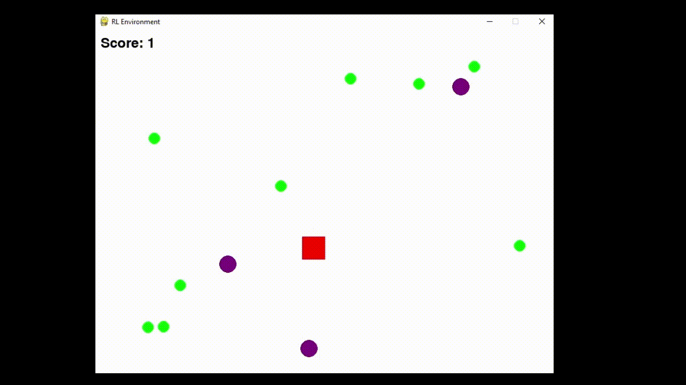
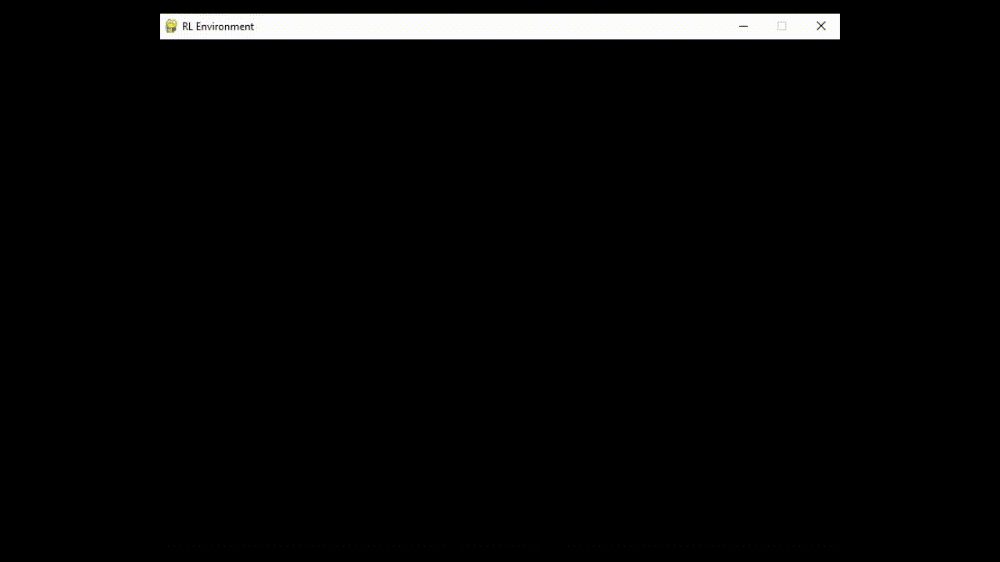
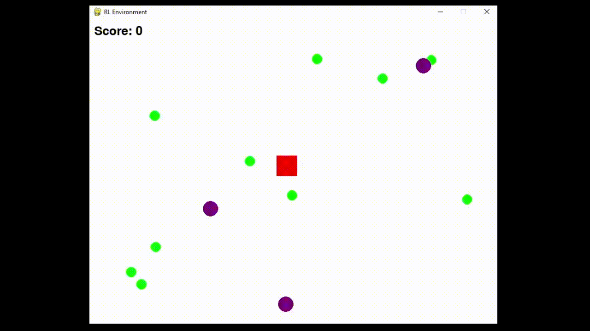

# Collector with Policy Gradient

**"Team_Two" Reinforcement Learning Project using Proximal Policy Optimization (PPO)**

---

## Introduction

In this project, we demonstrate the use of Proximal Policy Optimization (PPO), an advanced policy gradient algorithm, applied within a custom-built PyGame environment. Our primary goal is to explore key concepts in reinforcement learning, implement the PPO algorithm from scratch, and evaluate interactions between our learning agent and its environment through practical experimentation.

---

## Repository Structure

- **`/src`**: Contains the source code necessary for PPO, the environment, training loops, and evaluations.
  - `agent.py`: We implement the PPO agent, including policy definition, action selection, and model checkpoint handling.
  - `environment.py`: Defines our custom environment logic, handling interactions with reward items (balls) and penalty items (traps).
  - `train.py`: Manages our training loop and hyperparameter configurations.
  - `evaluate.py`: Runs evaluations of our trained agent.
  - `testing.py`: Facilitates manual testing of the environment without RL intervention.
  - `plot_results.py`: Generates visual representations of our training outcomes.

- `/saved_models`: Stores our trained models.
- `/training_plots`: Stores visualizations of our training performance.
- `/deprecated`: Contains older versions of scripts no longer actively used.

---

## Environment Description

Our custom environment simulates a 2D collector scenario where our agent collects rewards (balls) while avoiding penalties (traps).

- **Dimensions and Rendering**:  
  - An 800x600 pixel window visualized using PyGame.

- **Agent**:
  - A square (40px) moving at a constant speed (5 px/step).
  - Spawned near the center with slight randomness.

- **Objects**:
  - **Balls (Rewards)**: 10 balls (radius 10 pixels); rewards exponentially increase as balls are collected.
  - **Traps**: 3 traps (radius 15 pixels); collisions trigger a penalty and initiate a 30-step cooldown.

- **Reward Structure**:
  - Step Penalty: `-0.5` per step.
  - Ball Rewards: Progressive geometric scaling.
  - Trap Penalty: `-50`.
  - Wall Penalty: `-0.3`.
  - Shaping Reward (`0.08`): Encourages exploration and helps avoid local optima.
  - Finish Reward: `+200`.

- **Observation Space (Sensors)**:
  - 8 ball sensors positioned every 45 degrees around our agent, each providing normalized proximity readings (0-1).
  - 4 directional trap sensors (north, east, south, west), indicating proximity to traps.
  - A progress indicator representing the proportion of balls collected.

Example observation code:

```python
def _get_observation(self):
    ball_sensors = self._get_ball_sensors()
    trap_sensors = self._get_trap_sensors()
    progress = 1.0 - (np.sum(self.active_balls) / self.NUM_BALLS)

    return np.concatenate([
        ball_sensors,
        trap_sensors,
        [progress]
    ])
```

- **Action Space**:
  - 5 discrete actions: stationary, left, right, up, down.

---
## PPO Algorithm Implementation

We chose PPO for its stability and efficiency, implementing it using an Actor-Critic neural network architecture.

### Neural Network Structure

Our network contains:
- **Shared Layers**: Two fully connected layers (256 and 128 neurons with ReLU activation).
- **Actor**: Outputs action probabilities through a softmax layer.
- **Critic**: Estimates expected state values.

Example architecture:

```python
class PPONetwork(nn.Module):
    def __init__(self, input_size, hidden_size, output_size):
        super().__init__()
        self.shared = nn.Sequential(
            nn.Linear(input_size, hidden_size),
            nn.LayerNorm(256),
            nn.ReLU(),
            nn.Linear(hidden_size, 128),
            nn.ReLU()
        )
        self.actor = nn.Sequential(
            nn.Linear(128, 64),
            nn.ReLU(),
            nn.Linear(64, output_size)
        )
        self.critic = nn.Sequential(
            nn.Linear(128, 64),
            nn.ReLU(),
            nn.Linear(64, 1)
        )

    def forward(self, x):
        x = self.shared(x)
        return torch.softmax(self.actor(x), dim=-1), self.critic(x).squeeze()
```

### Experience Collection and Policy Updates

- We collected experiences using Generalized Advantage Estimation (GAE) to enhance training stability.
- PPO updates utilized:
  - Policy clipping (`ε = 0.25`).
  - Entropy regularization (`coef = 0.03`) to encourage exploration.
  - Gradient clipping (`norm = 0.5`) to maintain training stability.

---
## Training and Experimentation

- We trained for 1000 episodes, each limited to 500 steps.
- Policy updates occurred every 2000 steps.

### Curriculum Strategy
- Training began in a deterministic environment, gradually introducing variability (0 to ±50 px randomness in object positions) to generalize our agent's performance.

### Challenges Encountered:

- Initially, we used a pre-built PPO library ([GitHub Link](https://github.com/Abraxius/ReinforcementLearning/tree/main)). The project functioned but remained incomplete, motivating our custom implementation.
- Key implementation errors included:
  - Excessive initial randomness, complicating debugging. Controlled variability improved error identification.
  - Unstable learning due to initially suboptimal observations, corrected by sensor simulations.
  - Incorrect critic loss computations causing catastrophic forgetting; resolved through debugging and hyperparameter adjustments.
  - Poor trap avoidance, possibly due to improperly balanced rewards and penalties.

---

## Results

Visualizations of progress at key episodes:

| Episode | Visualization |
|----------|-------------|
| 1        |  |
| 250      |  |
| 500      |  |
| 750      |  |
| 1000     |  |

Our agent effectively learned to collect all balls but consistently struggled to avoid traps, highlighting the need for additional reward tuning or extended training.

---

## Future Work

Future improvements we plan include:

- Revisiting a fully randomized environment for robustness testing.
- Implementing additional rewards to encourage efficient movements.
- Investigating and resolving poor trap avoidance.
- Enhancing training efficiency through code optimization and parallelization.

---

## References

- [Proximal Policy Optimization (PPO) by OpenAI](https://spinningup.openai.com/)
- Schulman et al. (2017), [PPO Original Paper](https://arxiv.o# Collector with Policy Gradient

**"Team_Two" Reinforcement Learning Project using Proximal Policy Optimization (PPO)**

---

## Introduction

In this project, we demonstrate the use of Proximal Policy Optimization (PPO), an advanced policy gradient algorithm, applied within a custom-built PyGame environment. Our primary goal is to explore key concepts in reinforcement learning, implement the PPO algorithm from scratch, and evaluate interactions between our learning agent and its environment through practical experimentation.

---

## Repository Structure

- **`/src`**: Contains the source code necessary for PPO, the environment, training loops, and evaluations.
  - `agent.py`: We implement the PPO agent, including policy definition, action selection, and model checkpoint handling.
  - `environment.py`: Defines our custom environment logic, handling interactions with reward items (balls) and penalty items (traps).
  - `train.py`: Manages our training loop and hyperparameter configurations.
  - `evaluate.py`: Runs evaluations of our trained agent.
  - `testing.py`: Facilitates manual testing of the environment without RL intervention.
  - `plot_results.py`: Generates visual representations of our training outcomes.

- `/saved_models`: Stores our trained models.
- `/training_plots`: Stores visualizations of our training performance.
- `/deprecated`: Contains older versions of scripts no longer actively used.

---

## Environment Description

Our custom environment simulates a 2D collector scenario where our agent collects rewards (balls) while avoiding penalties (traps).

- **Dimensions and Rendering**:  
  - An 800x600 pixel window visualized using PyGame.

- **Agent**:
  - A square (40px) moving at a constant speed (5 px/step).
  - Spawned near the center with slight randomness.

- **Objects**:
  - **Balls (Rewards)**: 10 balls (radius 10 pixels); rewards exponentially increase as balls are collected.
  - **Traps**: 3 traps (radius 15 pixels); collisions trigger a penalty and initiate a 30-step cooldown.

- **Reward Structure**:
  - Step Penalty: `-0.5` per step.
  - Ball Rewards: Progressive geometric scaling.
  - Trap Penalty: `-50`.
  - Wall Penalty: `-0.3`.
  - Shaping Reward (`0.08`): Encourages exploration and helps avoid local optima.
  - Finish Reward: `+200`.

- **Observation Space (Sensors)**:
  - 8 ball sensors positioned every 45 degrees around our agent, each providing normalized proximity readings (0-1).
  - 4 directional trap sensors (north, east, south, west), indicating proximity to traps.
  - A progress indicator representing the proportion of balls collected.

Example observation code:

```python
def _get_observation(self):
    ball_sensors = self._get_ball_sensors()
    trap_sensors = self._get_trap_sensors()
    progress = 1.0 - (np.sum(self.active_balls) / self.NUM_BALLS)

    return np.concatenate([
        ball_sensors,
        trap_sensors,
        [progress]
    ])
```

- **Action Space**:
  - 5 discrete actions: stationary, left, right, up, down.

---
## PPO Algorithm Implementation

We chose PPO for its stability and efficiency, implementing it using an Actor-Critic neural network architecture.

### Neural Network Structure

Our network contains:
- **Shared Layers**: Two fully connected layers (256 and 128 neurons with ReLU activation).
- **Actor**: Outputs action probabilities through a softmax layer.
- **Critic**: Estimates expected state values.

Example architecture:

```python
class PPONetwork(nn.Module):
    def __init__(self, input_size, hidden_size, output_size):
        super().__init__()
        self.shared = nn.Sequential(
            nn.Linear(input_size, hidden_size),
            nn.LayerNorm(256),
            nn.ReLU(),
            nn.Linear(hidden_size, 128),
            nn.ReLU()
        )
        self.actor = nn.Sequential(
            nn.Linear(128, 64),
            nn.ReLU(),
            nn.Linear(64, output_size)
        )
        self.critic = nn.Sequential(
            nn.Linear(128, 64),
            nn.ReLU(),
            nn.Linear(64, 1)
        )

    def forward(self, x):
        x = self.shared(x)
        return torch.softmax(self.actor(x), dim=-1), self.critic(x).squeeze()
```

### Experience Collection and Policy Updates

- We collected experiences using Generalized Advantage Estimation (GAE) to enhance training stability.
- PPO updates utilized:
  - Policy clipping (`ε = 0.25`).
  - Entropy regularization (`coef = 0.03`) to encourage exploration.
  - Gradient clipping (`norm = 0.5`) to maintain training stability.

---
## Training and Experimentation

- We trained for 1000 episodes, each limited to 500 steps.
- Policy updates occurred every 2000 steps.

### Curriculum Strategy
- Training began in a deterministic environment, gradually introducing variability (0 to ±50 px randomness in object positions) to generalize our agent's performance.

### Challenges Encountered:

- Initially, we used a pre-built PPO library ([GitHub Link](https://github.com/Abraxius/ReinforcementLearning/tree/main)). The project functioned but remained incomplete, motivating our custom implementation.
- Key implementation errors included:
  - Excessive initial randomness, complicating debugging. Controlled variability improved error identification.
  - Unstable learning due to initially suboptimal observations, corrected by sensor simulations.
  - Incorrect critic loss computations causing catastrophic forgetting; resolved through debugging and hyperparameter adjustments.
  - Poor trap avoidance, possibly due to improperly balanced rewards and penalties.

---

## Results

Visualizations of progress at key episodes:

| Episode | Visualization |
|----------|-------------|
| 1        |  |
| 250      |  |
| 500      |  |
| 750      |  |
| 1000     |  |

Our agent effectively learned to collect all balls but consistently struggled to avoid traps, highlighting the need for additional reward tuning or extended training.

---

## Future Work

Future improvements we plan include:

- Revisiting a fully randomized environment for robustness testing.
- Implementing additional rewards to encourage efficient movements.
- Investigating and resolving poor trap avoidance.
- Enhancing training efficiency through code optimization and parallelization.

---

## References

- [Proximal Policy Optimization (PPO) by OpenAI](https://spinningup.openai.com/)
- Schulman et al. (2017), [PPO Original Paper](https://arxiv.o